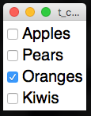

##CheckBox
____
A simple tick-box, with a label, that can be either ON or OFF.  

  

```python
from appJar import gui

app=gui()
app.setFont(20)

app.addCheckBox("Apples")
app.addCheckBox("Pears")
app.addCheckBox("Oranges")
app.addCheckBox("Kiwis")

app.setCheckBox("Oranges")

app.go()
```

####Add CheckBoxes
* `.addCheckBox(title)`  
    This creates a CheckBox, with the specified title.  

* `.addNamedCheckBox(name, title)`  
    By default, it's not possible to have two CheckBoxes with the same text.  
    If that's required, a named CheckBox should be used.  
    This creates a CheckBox, with the specified title.  
    The name will be displayed next to the CheckBox, and the title passed to the function as a unique ID.  

####Set CheckBoxes

* `.setCheckBox(title, ticked=True, callFunction=True)`  
    This will tick the CheckBox, or untick it if ticked is set to False.  
    Set ```callFunction``` to be False, if you don't want to call any associated functions.  

* `.clearAllCheckBoxes(callFunction=False)`  
    This will clear (untick) all CheckBoxes in the app.  
    Set ```callFunction``` to be True, if you want to call any associated functions.  

####Get CheckBoxes

* `.getCheckBox(title)`  
    This will return True or False, depending on the state of the CheckBox.  

* `.getAllCheckBoxes()`  
    This will return the contents of all CheckBoxes in the app, as a dictionary.  
