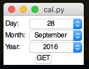

##DatePicker
---
A widget to capture a date - will handle presenting accurate drop-downs, and return a date.  
  

```python
from appJar import gui

def showDate(btn):
    print(app.getDatePicker("dp"))

app=gui()
app.addDatePicker("dp")
app.addButton("GET", showDate)
app.setDatePickerRange("dp", 1900, 2100)
app.setDatePicker("dp")
app.go()
```
####Add DatePickers  

* `.addDatePicker(title)`  
    Create a DatePicker, with a range from 1/1/1970 to 31/12/2020  

####Set DatePickers  

* `.setDatePicker(title, date=None)`  
    Will set the specified DatePicker to the specified date, or current date if no date is supplied.  

* `.setDatePickerRange(title, startYear, endYear=None)`  
    Set the range for the named DatePicker.  
    If endYear is None, the current Year will be used.  

* `.setDatePickerChangeFunction(title, function)`  
    Set a function to call when the DatePicker is changed.  

* `.clearDatePicker(title, callFunction=True)`  
    This will reset the specified DatePicker to the earliest available date.  
    Set ```callFunction``` to be False, if you don't want to call any associated functions.  

* `.clearAllDatePickers(callFunction=False)`  
    This will reset all DatePickers in the app to their earliest available date.  
    Set ```callFunction``` to be True, if you want to call any associated functions.  

####Get DatePickers  

* `.getDatePicker(title)`  
    Will return the currently selected date.  

* `.getAllDatePickers()`  
    This will return the contents of all DatePickers in the app, as a dictionary.  
