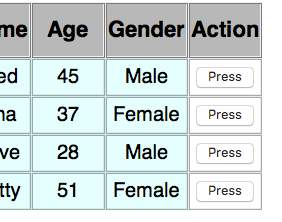

###Grid ([beta](https://en.wikipedia.org/wiki/Software_release_life_cycle#BETA))  
---
Used to create a spreadsheet like interface.  
The grid has mouse interactivity, with mouse-over highlighting, and mouse-click highlighting.  
It is possible to include buttons at the end of each row, and an additional row of entry boxes, with their own button.  

  

```python
from appJar import gui

app = gui()
app.setFont(20)
app.addGrid("g1",
    [["Name", "Age", "Gender"],
    ["Fred", 45, "Male"],
    ["Tina", 37, "Female"],
    ["Clive", 28, "Male"],
    ["Betty", 51, "Female"]])
app.go()
```

####Add Grids  

* `.addGrid(title, data, action=None, addRow=None)`  
    Receives a (jagged) 2D list of values. The first list should be the headers for the grid, the rest will contain each row of values.  

    If `action` is set, a button will be created, at the end of each row, calling the specified function. It will pass the row number (starting at 0).  

       

    If `addRow` is set, then an additional row will appear at the end of the grid, with entry boxes and a button to call the specified function.  
    The button will pass the string `newRow` to the specified function.  

       

    If both parameters are set to a function, then both buttons at the end of each row and a row of Entry boxes will be shown:  

       

    It's also possible to set the following parameters:  
        * `actionHeading` - set the title of the right column  
        * `actionButton` - set the button text for each row  
        * `addButton` - set the button text for the Entry row  
        * `showMenu` - boolean to show a right-click menu  

       

#### Connecting to Databases

* `.addDbGrid(title, db, table)`  
    Will connect to the specified database, and show all rows in the specified table.  
    appJar will query the table to detect the PrimaryKey, and use this as the key when selecting the row.

* `.replaceDBGrid(title, db, table)`  
    Will replace the currently shown data in the grid, with the data found in the specified database/table.  

#### Get Grids  

* `.getGridRow(title, rowNumber)`  
    Returns a list of values representing the specified row.  

* `.getGridRowCount(title)`  
    Returns a count of how many rows are in the grid (not including the header row).  

* `.getGridSelectedCells(title)`  
    Gets a dictionary of booleans, indicating the status of each cell.  
    True indicates the cell is selected, False indicates the cell is not selected.  
    The name of each entry on the dictionary will be in the format ROW-COLUMN, eg. 0-2  

* `.getGridEntries(title)`  
    If `addRow` was set when the *Grid* was created, this function will get the contents of the entry boxes.  
    They will be returned as a list, in the same order as the entry boxes.  

####Set Grids  

* `.addGridRow(title, data)`  
    Adds a new row of data to the end of the existing grid.  
    It will be positioned at the bottom of the grid, above the entry boxes if present.  

To have the **Press** button on the entries row add a new row of data, try the following:  
```python
    def press(btn):
        if btn == "addRow":     # the button on the entries row
            data = app.getGridEntries("g1")
            app.addGridRow("g1", data)
``` 

* `.addGridRows(title, data)`  
    Adds the new rows of data to the end of the existing grid.  

* `.replaceGridRow(title, rowNum, data)`  
    Replace the values in the specified row with the new data.  
    If the new data has fewer items, the remaining cells will be emptied.  

* `.replaceAllGridRows(title, rowNum, data)`  
    Removes all existing rows, before adding the new rows.  

* `.setGridHeaders(title, data)`  
    Replace the values in the header row.  
    If the new data has fewer items, the remaining header cells will be emptied.  

* `.deleteGridRow(title, rowNum)`  
    Delete the specified row from the specified grid.

* `.deleteAllGridRows(title)`  
    Delete all rows from the specified grid (except the header row).  

* `.addGridColumn(title, columnNumber, data)`  
    Add the column of data to the named grid, in the specified position.  

* `.deleteGridColumn(title, columnNumber)`  
    Delete the specified column from the named grid.  
