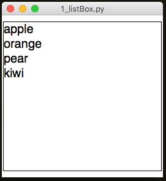

##ListBox
---

A box containing a list of items, single or multi-select

  

```python
from appJar import gui

app=gui()
app.setFont(20)
app.addListBox("list", ["apple", "orange", "pear", "kiwi"])
app.go()
```

####Add ListBoxes
* `.addListBox(title, values)`  
    Creates a ListBox with the specified values.  

* `.addListItem(title, item)`  
    Adds a single item to the the end of the ListBox, and selects it.  

* `.addListItems(title, items)`  
    Adds a list of items to the end of the List Box, selecting the last one.  

####Set ListBoxes
* `.setListItem(title, item, newVal, first=False)`  
    `.setListItemAtPos(title, pos, newVal)`  
    Changes the specified list item to the new value.  
    If `first` is set to True, only the first item found will be changed.  
    Otherwise, all occurrences of the specified value will be changed.  

* `.removeListItem(title, item)`  
    `.removeListItemAtPos(title, pos)`  
    Remove the specified item from the  specified ListBox.  
    Will only remove the first item that matches the parameter.  

* `.clearListBox(title, callFunction=True)`  
    Removes all items from the specified ListBox.  
    Set ```callFunction``` to be False, if you don't want to call any associated functions.  

* `.clearAllListBoxes(callFunction=False)`  
    This will remove all items from all ListBoxes in the app.  
    Set ```callFunction``` to be True, if you want to call any associated functions.  

* `.updateListBox(title, items, select=False)`  
    Replace the contents of the specified ListBox with the new values.  
    If you set `select` to be True, the last item in the list will be selected.  

```python
from appJar import gui
def press(btn):
    items = app.getListItems("list")
    if len(items)> 0:
        app.removeListItem("list", items[0])

app=gui()
app.setFont(20)
app.addListBox("list", ["apple", "orange", "pear", "kiwi"])
app.addButton("press",  press)
app.go()
```

* `.selectListItem(title, item, callFunction=True)`  
    `.selectListItemAtPos(title, pos, callFunction=False)`  
    Selects the specified item in the specified ListBox.  
    Set ```callFunction``` to be False, if you don't want to call any associated functions.  

* `.setListBoxRows(title, rows)`  
    Sets how many rows to display in the specified ListBox.  

* `.setListBoxMulti(list, multi=True)`  
    Configures whether the specified ListBox is single or multi select.  

* `.setListBoxGroup(list, group=True)`  
    Adds the named ListBox to a group of selectable ListBoxes.  
    All ListBoxes in the group can have items selected at the same time.  

* `.setListItemBg(title, item, colour)` & `.setListItemFg(title, item, colour)`  
    `.setListItemAtPosBg(title, item, colour)` & `.setListItemAtPosFg(title, item, colour)`  
    Sets the background or foreground colours the specified ListBox item.  
    Can either specify a named item (will update all with that name) or the position of an item.  

  

####Get ListBoxes

* `.getListBox(title)`  
    Gets all of the selected items from the specified ListBox.  

* `.getAllListBoxes()`  
    This will return the contents of all ListBoxes in the app, as a dictionary.  

* `.getAllListItems(title)`  
    Gets all of the items from the specified ListBox.  
