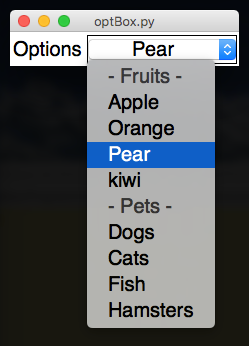
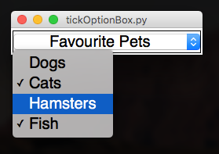

##OptionBox
____
Creates a simple drop-down box.  
It is only possible to select one option from this drop-down.  
Pass in a list of values to show in the drop-down box.  
They will be added in the same order, with the first item shown.  
If the first item is empty, a simple title `- options -` will be created.  
Any other empty items will be removed.  
If an item starts with a dash (-), it will be treated as a separator, and can't be selected.  

   

```python
from appJar import gui

app=gui()
app.setFont(20)
app.addLabelOptionBox("Options", ["- Fruits -", "Apple", "Orange",
                        "Pear", "kiwi", "- Pets -", "Dogs", "Cats",
                        "Fish", "Hamsters"])
app.go()
```

####Add OptionBoxes
* `.addOptionBox(title, values)`  
    This will create an OptionBox, adding the contents of the values list, in the order specified.  

* `.addTickOptionBox(title, values)`  
    This will create an OptionBox made up of check boxes.  
    The `title` will always be displayed as the *selected* entry in the OptionBox, event though it can't be selected/ticked.  
    Instead of selecting a single item, you tick the ones you want.  
      

    Calling `.getOptionBox(title)` will return a dictionary of the options along with a True/False value.  

```python
from appJar import gui

def get(btn):
    print(app.getOptionBox("Favourite Pets"))

app=gui()
app.setFont(20)
app.addTickOptionBox("Favourite Pets", ["Dogs", "Cats", "Hamsters", "Fish"])
app.addButton("GET", get)
app.go()
```

####Set OptionBoxes
* `.changeOptionBox(title, newOptions, index, callFunction=False)`  
    This will replace the contents of the OptionBox, with the new list provided.  
    If specified, the indexed item will be selected - this can be a position or an item name.  
    If setting a TickOptionBox, the old list will be replaced with the new list. None will be ticked. `index` will be ignored.  
    Set ```callFunction``` to be True, if you want to call any associated `change` functions.  

* `.setOptionBox(title, position, value=True, callFunction=True, override=False)`  
    This will select the item in the list, at the position specified.  
    Alternatively, the name of an item can be specified.  
    If changing a TickOptionBox, the specified item will be set to the specified value.  
    Set ```callFunction``` to be False, if you don't want to call any associated functions.  
    By default, you can't select a disabled item. You can change this by setting `override` to be True.  

* `.renameOptionBoxItem(title, item, newName, callFunction=False)`  
    This will rename the specified item in the named OptionBox.  
    Set ```callFunction``` to be True, if you want to call any associated `change` functions.  

* `.clearOptionBox(title, callFunction=True)`  
    This will set the named OptionBox back to its first value (even if it's disabled).  
    Set ```callFunction``` to be False, if you don't want to call any associated functions.  

* `.clearAllOptionBoxes(callFunction=False)`  
    This will set all OptionBoxes in the app back to their first value (even if it's disabled).  
    Set ```callFunction``` to be True, if you want to call any associated functions.  

* `.deleteOptionBox(title, position)`  
    This will delete the item in the list, at the position specified.  
    Alternatively, the name of an item can be specified.  
    Not available on TickOptionBoxes.  

####Get OptionBoxes

* `.getOptionBox(title)`  
    This will return the currently displayed value in an OptionBox.  
    Or a dictionary of names, and their boolean value if a TickOptionBox.  
    Will return None, if an invalid option is currently selected.  

* `.getAllOptionBoxes()`  
    This will return the contents of all OptionBoxes in the app, as a dictionary.  
