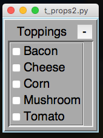

##Properties
____
A compound widget that shows multiple CheckButtons linked to a dictionary.  
Note, dictionaries have no order, so when added as a dictionary, the items will be automatically sorted.  


```python
from appJar import gui

toppings={"Cheese":False, "Tomato":False, "Bacon":False,
            "Corn":False, "Mushroom":False}

app=gui()
app.setBg("lightBlue")
app.setFont(20)
app.addProperties("Toppings", toppings)
app.setProperty("Toppings", "Pepper")
app.go()
```

####Add Properties
* `.addProperties(title, values)`  
    Creates a new Properties widget, with the specified title.  
    If values is populated, then the dictionary items will be added to the widget.  

####Set Properties

* `.setPropertyText(title, prop, newText=None)`  
    Change the displayed text for the named property.  
    If no value is provided, the original value will be used.  

* `.setProperties(title, props, callFunction=True)`  
    Adds the dictionary of properties to the widget.  
    If any of them already exist, they will be updated.  
    Set ```callFunction``` to be False, if you don't want to call any associated functions.  

* `.setProperty(title, prop, value=False, callFunction=True)`  
    Sets the named property to the specified value.  
    If it doesn't exist, it will be added first, at the end of the widget.  
    Set ```callFunction``` to be False, if you don't want to call any associated functions.  

* `.deleteProperty(title, prop)`  
    Deletes the named property from the widget.  

* `.resetProperties(title, callFunction=True)`  
    This will reset the specified Properties back to its original values.  
    Set ```callFunction``` to be False, if you don't want to call any associated functions.  

* `.clearProperties(title, callFunction=True)`  
    This will set all values in the specified Properties to False.  
    Set ```callFunction``` to be False, if you don't want to call any associated functions.  

* `.resetAllProperties(callFunction=False)`  
    This will reset all Properties in the app back to their original values.  
    Set ```callFunction``` to be True, if you want to call any associated functions.  

* `.clearAllProperties(callFunction=False)`  
    This will set all values in all Properties in the app to False.  
    Set ```callFunction``` to be True, if you want to call any associated functions.  

####Get Properties

* `.getProperties(title)`  
    Gets a dictionary of the all items in the Properties widget.  

* `.getAllProperties()`  
    This will return the contents of all Properties in the app, as a dictionary.  

* `.getProperty(title, prop)`  
    Gets the value of the named property.  

####Examples
It's possible to put Properties into ToggleFrames, and also set a Function to listen for any changes.  





```python
from appJar import gui

def changed(props):
    print("Changed", props)

toppings={"Cheese":False, "Tomato":False, "Bacon":False,
            "Corn":False, "Mushroom":False}

app=gui()
app.setBg("lightBlue")
app.setFont(20)

app.startToggleFrame("Toppings")
app.addProperties("Toppings", toppings)
app.setPropertiesChangeFunction("Toppings", changed)
app.stopToggleFrame()

app.go()
```
